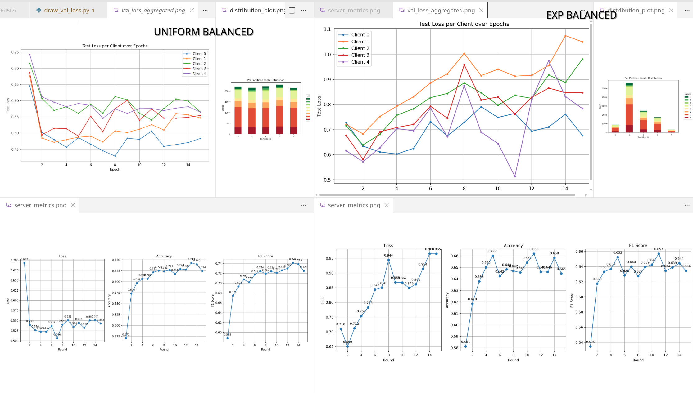
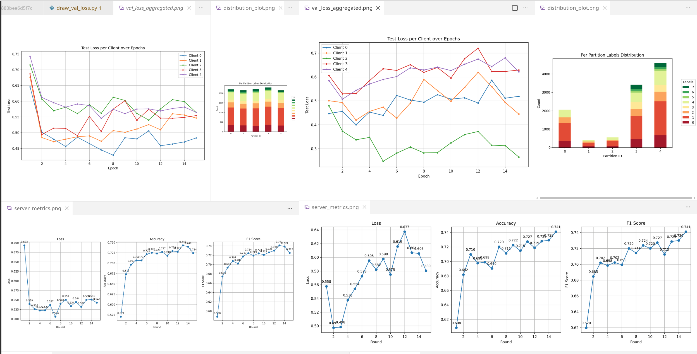
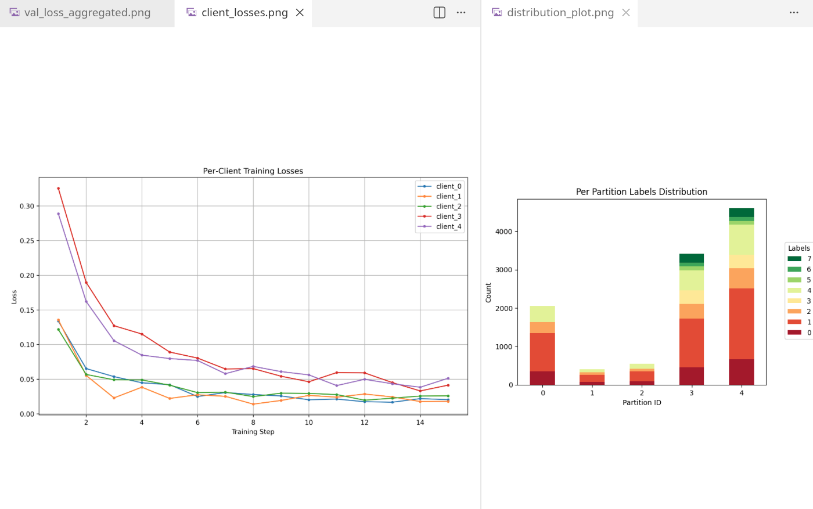
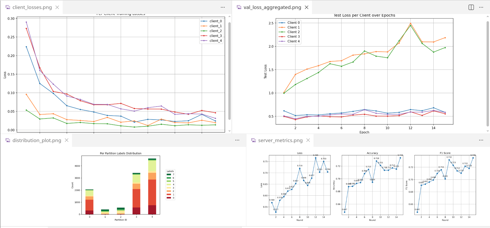

В рамках данного задания были выполнены первые запуски с неоднородными данными, добавлены алгоритмы федеративного обучения Scaffold и FedProx в симулятор, добавлены новые метрики (f1 взвешенный, f1 настоящий, вектор неоднородности данных), развито генерирование размера датасета на клиентах. Из технических моментов - поправлена передача параметров и дата лик из-за пересоздание клиентов фреймворком.

# Добавление алгоритмов
FedProx - поиск неточного решения на клиентах, которое может регулироваться мощностью клиентов. Был встроен простой вариант, который одинаково на всех клиентах штрафовал за отдаление весов от глобального на предыдущем шаге, а серверная часть не отличается от FedAvg

Scaffold - алгоритм, в котором направление обновления весов корректируется относительно глобального направления глобальной модели, позволяя локальным моделям меньше отклоняться друг относительно друга.

Однако на момент их запуска в коде была ошибка при обновлении весов, которая была найдена через запуск на более простом наборе данных - cifar, где классы сбалансированы. Изначально между клиентами и сервером не передавались средние и дисперсии в слоях BatchNormalization даже на модели MobileNet. Это было поправлено, и метрики стали выдавать 90+%, что в итоге появлялась, из-за того, что клиенты в фреймфорке Flower постоянно пересоздавались заново, а random seed не фиксировался при разбиение на train и test.

Также в процессе поисков была добавлена динамическая аугментация для разного рода классов, но она скорее была необходимостью, поскольку в наборе данных несколько классов присутствовали в очень маленьком количестве, и сильно меньше чем остальные классы. Поэтому для классов в количестве < 10% от всего размера применялась сильная аугментация (+6 доп примеров с поворотами, сдвигами и небольшой цветовой коррекцией), для < 20% - средняя (+2 примера), остальные оставались прежними. Таким образом, дисбаланс классов уменьшался, если классы вообще присутствовали на клиенте.

# Запуски с дисбалансом

## Дисбаланс размеров наборов данных на клиентах

В одном эксперименте размер данных был примерно одним и тем же на всех клинтах, и распределение классов на каждом клиенте - одинаковый. В втором эксперименте - размер данных сильно отличался на клиентах (в около десять раз между наименьшим и наибольшим).

В первом loss и метрики качества стабилизируются и последние достигают значений около 0.72, в втором - loss растет, хотя метрики стабилизиуются около 0.65. Рост loss может говорит о менее уверенной модели при каждом следующем раунде FL. Также вижно, что валидационный loss у второго эксперимента имеет тренд на рост, с самым большим loss на самом объемном клиенте. Возможно, на него выпали самые трудные примеры классификации, которые до этого выпадали на 2 и 4 клиентов в первом эксперименте. Осталось понять, почему неуверенность модели растет на всех клиентах. По идее, рост возникает даже у самого большого клиента, хотя он должен вносить больший вклад в глобальную модель и меньше быть под влиянием остальных клиентов. При этом количество локальных эпох на каждом клиенте было выставлено в 3 (иначе может возникать дрейф моделей). Есть предположение, что во втором эксперименте первый клиент (нумерация с нуля) учит паттерны только своего локального набора данных, и чем больше он его учит, тем неувереннее становится не из-за характеристики FL, а потому что датасет довольно трудный. При этом обучении другие клиенты не превносят большой вклад в развитие первой локальной модели (нумерация с нуля) и поэтому она обучается как стандалон модель, и тянет остальные локальные модели к своей. Из-за этого остальныые могут также становится менее уверенными, и с большим loss из-за тяги к модели первого клиента. В первом эксперименте (с одинаковыми размерами) это не наблюдается, поскольку при агрегации может быть усреднение каких-нибудь специфичных весов и фокус на более общих, из-за чего все модели учат общие паттерны равномерно и не переобучаются. Для проверки данных предположений можно посмотреть, как ведет себя локальная модель для данных первого клиента из второго эксперимента.

Также есть идея, чтобы отправлять модели учиться на данные клиенты, с сильно большим числом данных, в меньшее число раундов. Например, каждый второй раз отправлять данные, и каждой второй раз - нет, агрегируя веса только с меньших клиентов вместе с наибольшими с предыдущих раундов, где наибольшее также принимали участие в обучении.

## Дисбаланс классов rare_on_often

Размер классов отличался в ~10 раз между наименьшим и наибольшим, но редкие классы данных находились только  на наибольших клиентах (для настройки из 5 было выбрано 2 наибольших). Метрики качества за 15 эпох достигли аналогичных при uniform-balanced запуске, Loss при этом рос при 3-12 раундах из 15, после был небольшой тренд на спад. В целом, можно провести еще несколько подобных запусков и с большим количеством раундов, но до этого были трудности с генерацией размеров датасетов, которые решались ближе к концу чекпойнта. Из валидационных графиков виден небольшой рост у большинства клиентов, при сильно выделяющихся клинтах с редкими значениями в сторону большего loss. 
Также они выделяются на тренировочных loss в аналогичную сторону.

При этом, рост неуверенности не столько большой как в эксперименте из предыдущего раздела, возможно, что сложные примеры попали на 3-4 клиентах (нумерация с нуля), однако разного вида, из-а чего они лучше затирают веса, которые активируются на каких-то специфичных случаях.

Здесь также есть идея для развития - делать виртуальных клиентов, которые бы разделили весь их набор данных на два, но считались бы разными клиентами, и у них бы шла агрегация на уровне разных клиентов. Условно, присылается глобальная модель, данные делятся, обучаются две локальные модели, и отсылаются обратно две локальные модели, которые участвуют независимо. Это может сработать как раз из-за картины данного эксперимента, когда наибольшие клиенты были аналогичны одному клиенту из предыдущего раздела, но при этом метрики качества - наравне с IID.

## Дисбаланс классов rare_on_rare

Данный эксперимент содержит также сильно различающиеся размеры клиентов, но теперь редкие данные в основном находятся на малых клиентах (в количестве два). Из графиков видно, что при хорошем обучении и тренировочном loss, валидационный loss на глобальной модели - сильно превышает тренировочный, растет около единицы. Это с большой вероятностью возникает из-за того, что бОльшие клиенты тянут веса моделей на более популярные на них классы. 

И здесь возможно стоит остановится с той точки зрения, что идеология обучения нашей задачи не в том, чтобы обучить модель под каждого клиента, какое бы там распределение не было, а обучить хорошую глобальную модель. И если данные на некоторых небольших клиентах слишком специфичные, то мы возможно не хотим их учить - в том числе чтобы не возникало раскрытия информации о некоторых клиентах.

Другой вопрос, если каждый из клиентов имеет редкие данные, как и было в данном запуске, но они не могли превалировать над более обширным классом. Для этого видеться или аугментация, или взвешенный функция ошибки, или какое-нибудь хитрое вычленение части весов, выучивающих редкие классы, или большие число проходов на более редкий данных при локальном этапе обучения. Но возможно, на данном этапе это излишне из-за идеи, высказанной ранее, про приватность и хорошую глобальную модель.

# Запуск с большим числом локальных эпох

